# Architecture Diagrams

This document contains visual representations of the namegenerator architecture, data flows, and component relationships.

---

## Table of Contents

- [System Overview](#system-overview)
- [Component Architecture](#component-architecture)
- [Data Flow Diagrams](#data-flow-diagrams)
- [Class Diagrams](#class-diagrams)
- [Sequence Diagrams](#sequence-diagrams)
- [State Diagrams](#state-diagrams)

---

## System Overview

### High-Level Architecture

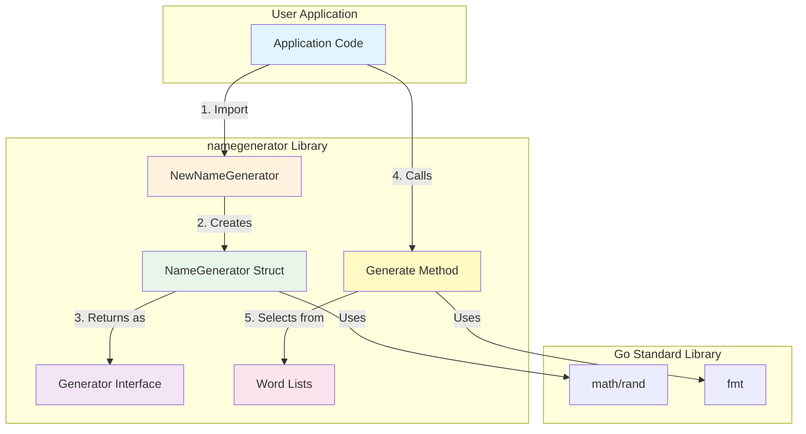
```mermaid
graph TB
    subgraph "User Application"
        App[Application Code]
    end

    subgraph "namegenerator Library"
        Constructor[NewNameGenerator]
        Interface[Generator Interface]
        Implementation[NameGenerator Struct]
        Method[Generate Method]
        Data[Word Lists]
    end

    subgraph "Go Standard Library"
        Rand[math/rand]
        Fmt[fmt]
    end

    App -->|"1. Import"| Constructor
    Constructor -->|"2. Creates"| Implementation
    Implementation -->|"3. Returns as"| Interface
    App -->|"4. Calls"| Method
    Method -->|"5. Selects from"| Data
    Implementation -->|"Uses"| Rand
    Method -->|"Uses"| Fmt

    style App fill:#e1f5fe
    style Constructor fill:#fff3e0
    style Interface fill:#f3e5f5
    style Implementation fill:#e8f5e9
    style Method fill:#fff9c4
    style Data fill:#fce4ec
```

---

## Component Architecture

### Module Structure

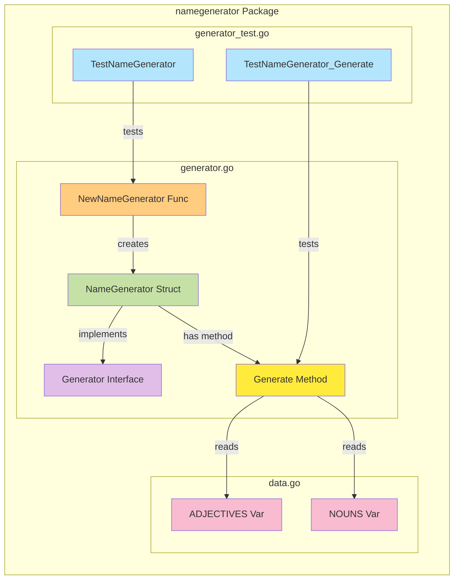
```mermaid
graph LR
    subgraph "namegenerator Package"
        subgraph "generator.go"
            GI[Generator Interface]
            NG[NameGenerator Struct]
            NGC[NewNameGenerator Func]
            GM[Generate Method]
        end

        subgraph "data.go"
            ADJ[ADJECTIVES Var]
            NOUNS[NOUNS Var]
        end

        subgraph "generator_test.go"
            T1[TestNameGenerator]
            T2[TestNameGenerator_Generate]
        end
    end

    NGC -->|creates| NG
    NG -->|implements| GI
    NG -->|has method| GM
    GM -->|reads| ADJ
    GM -->|reads| NOUNS
    T1 -->|tests| NGC
    T2 -->|tests| GM

    style GI fill:#e1bee7
    style NG fill:#c5e1a5
    style NGC fill:#ffcc80
    style GM fill:#ffeb3b
    style ADJ fill:#f8bbd0
    style NOUNS fill:#f8bbd0
    style T1 fill:#b3e5fc
    style T2 fill:#b3e5fc
```

### Dependency Graph

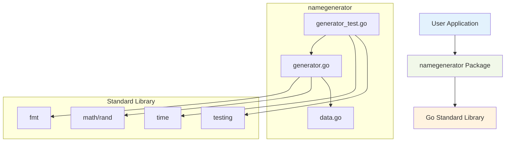
```mermaid
graph TD
    App[User Application]
    NG[namegenerator Package]
    StdLib[Go Standard Library]

    App --> NG
    NG --> StdLib

    subgraph "namegenerator"
        Gen[generator.go]
        Data[data.go]
        Test[generator_test.go]
    end

    subgraph "Standard Library"
        Fmt[fmt]
        Rand[math/rand]
        Time[time]
        Testing[testing]
    end

    Gen --> Fmt
    Gen --> Rand
    Gen --> Data
    Test --> Gen
    Test --> Time
    Test --> Testing

    style App fill:#e3f2fd
    style NG fill:#f1f8e9
    style StdLib fill:#fff3e0
```

---

## Data Flow Diagrams

### Name Generation Flow

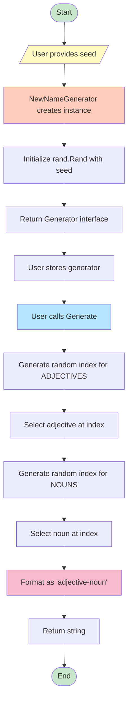
```mermaid
flowchart TD
    Start([Start]) --> Input[/"User provides seed"/]
    Input --> Create[NewNameGenerator creates instance]
    Create --> Init[Initialize rand.Rand with seed]
    Init --> Return[Return Generator interface]
    Return --> Store[User stores generator]

    Store --> GenCall[User calls Generate]
    GenCall --> RandAdj[Generate random index for ADJECTIVES]
    RandAdj --> SelectAdj[Select adjective at index]
    SelectAdj --> RandNoun[Generate random index for NOUNS]
    RandNoun --> SelectNoun[Select noun at index]
    SelectNoun --> Format[Format as 'adjective-noun']
    Format --> ReturnName[Return string]
    ReturnName --> End([End])

    style Start fill:#c8e6c9
    style Input fill:#fff9c4
    style Create fill:#ffccbc
    style GenCall fill:#b3e5fc
    style Format fill:#f8bbd0
    style End fill:#c8e6c9
```

### Constructor Initialization Flow

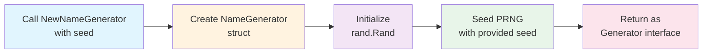
```mermaid
flowchart LR
    A[Call NewNameGenerator<br/>with seed] --> B[Create NameGenerator<br/>struct]
    B --> C[Initialize<br/>rand.Rand]
    C --> D[Seed PRNG<br/>with provided seed]
    D --> E[Return as<br/>Generator interface]

    style A fill:#e1f5fe
    style B fill:#fff3e0
    style C fill:#f3e5f5
    style D fill:#e8f5e9
    style E fill:#fce4ec
```

---

## Class Diagrams

### Type Hierarchy

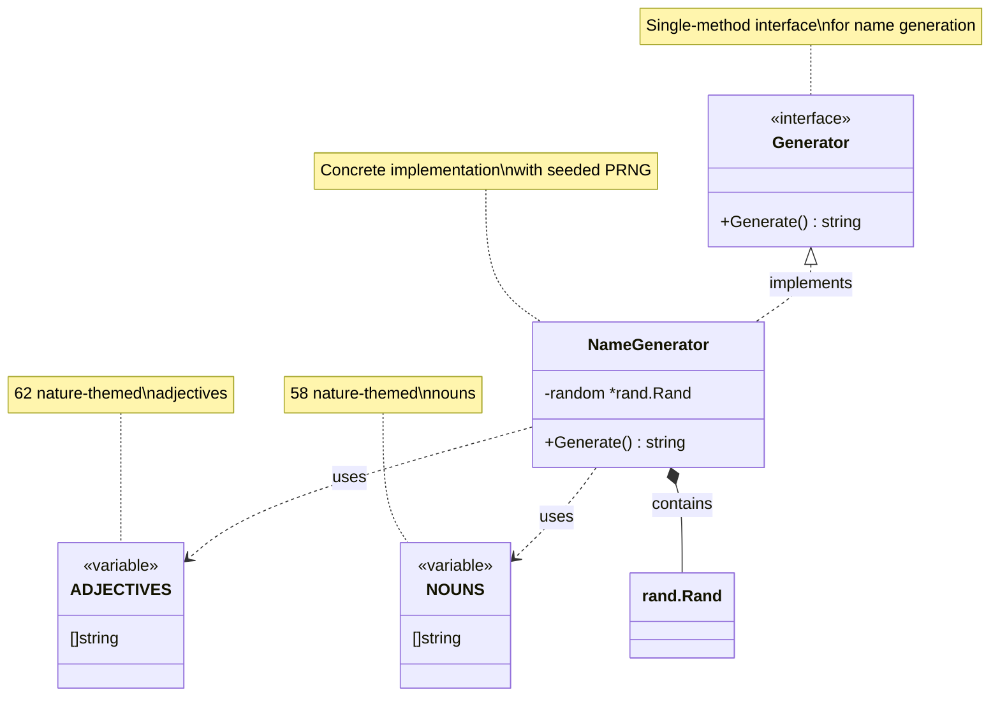
```mermaid
classDiagram
    class Generator {
        <<interface>>
        +Generate() string
    }

    class NameGenerator {
        -random *rand.Rand
        +Generate() string
    }

    class ADJECTIVES {
        <<variable>>
        []string
    }

    class NOUNS {
        <<variable>>
        []string
    }

    Generator <|.. NameGenerator : implements
    NameGenerator ..> ADJECTIVES : uses
    NameGenerator ..> NOUNS : uses
    NameGenerator *-- rand.Rand : contains

    note for Generator "Single-method interface\nfor name generation"
    note for NameGenerator "Concrete implementation\nwith seeded PRNG"
    note for ADJECTIVES "62 nature-themed\nadjectives"
    note for NOUNS "58 nature-themed\nnouns"
```

### Complete API Structure

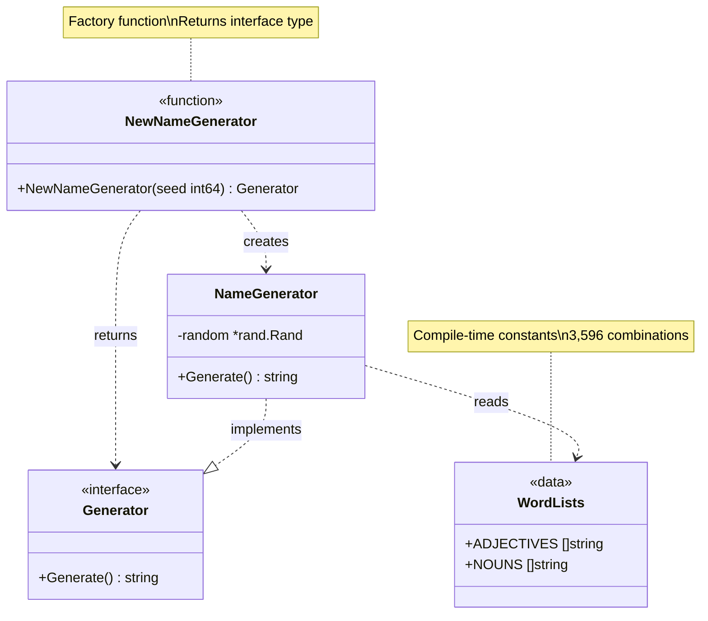
```mermaid
classDiagram
    direction TB

    class Generator {
        <<interface>>
        +Generate() string
    }

    class NameGenerator {
        -random *rand.Rand
        +Generate() string
    }

    class NewNameGenerator {
        <<function>>
        +NewNameGenerator(seed int64) Generator
    }

    class WordLists {
        <<data>>
        +ADJECTIVES []string
        +NOUNS []string
    }

    NewNameGenerator ..> NameGenerator : creates
    NewNameGenerator ..> Generator : returns
    NameGenerator ..|> Generator : implements
    NameGenerator ..> WordLists : reads

    note for NewNameGenerator "Factory function\nReturns interface type"
    note for WordLists "Compile-time constants\n3,596 combinations"
```

---

## Sequence Diagrams

### Basic Usage Sequence

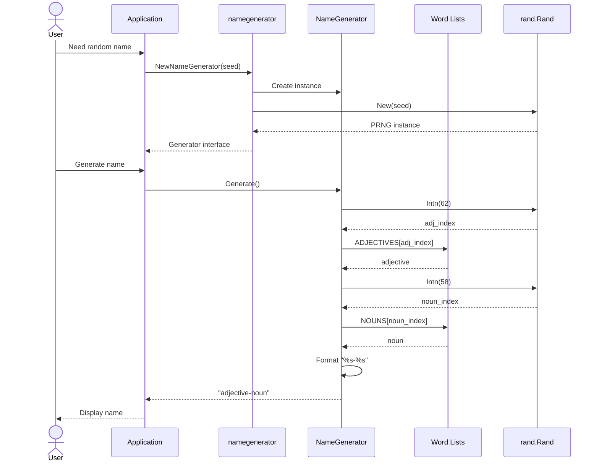
```mermaid
sequenceDiagram
    actor User
    participant App as Application
    participant Lib as namegenerator
    participant NG as NameGenerator
    participant Words as Word Lists
    participant Rand as rand.Rand

    User->>App: Need random name
    App->>Lib: NewNameGenerator(seed)
    Lib->>NG: Create instance
    Lib->>Rand: New(seed)
    Rand-->>Lib: PRNG instance
    Lib-->>App: Generator interface

    User->>App: Generate name
    App->>NG: Generate()
    NG->>Rand: Intn(62)
    Rand-->>NG: adj_index
    NG->>Words: ADJECTIVES[adj_index]
    Words-->>NG: adjective
    NG->>Rand: Intn(58)
    Rand-->>NG: noun_index
    NG->>Words: NOUNS[noun_index]
    Words-->>NG: noun
    NG->>NG: Format "%s-%s"
    NG-->>App: "adjective-noun"
    App-->>User: Display name
```

### Multiple Generation Sequence

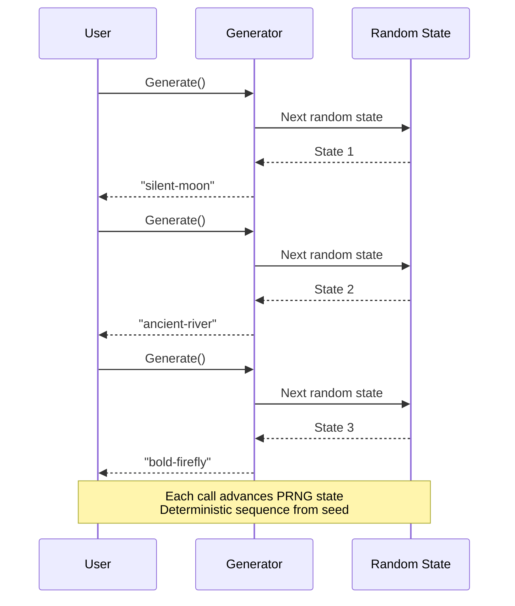
```mermaid
sequenceDiagram
    participant User
    participant Gen as Generator
    participant PRNG as Random State

    User->>Gen: Generate()
    Gen->>PRNG: Next random state
    PRNG-->>Gen: State 1
    Gen-->>User: "silent-moon"

    User->>Gen: Generate()
    Gen->>PRNG: Next random state
    PRNG-->>Gen: State 2
    Gen-->>User: "ancient-river"

    User->>Gen: Generate()
    Gen->>PRNG: Next random state
    PRNG-->>Gen: State 3
    Gen-->>User: "bold-firefly"

    Note over User,PRNG: Each call advances PRNG state<br/>Deterministic sequence from seed
```

### Concurrent Usage (Unsafe Pattern)

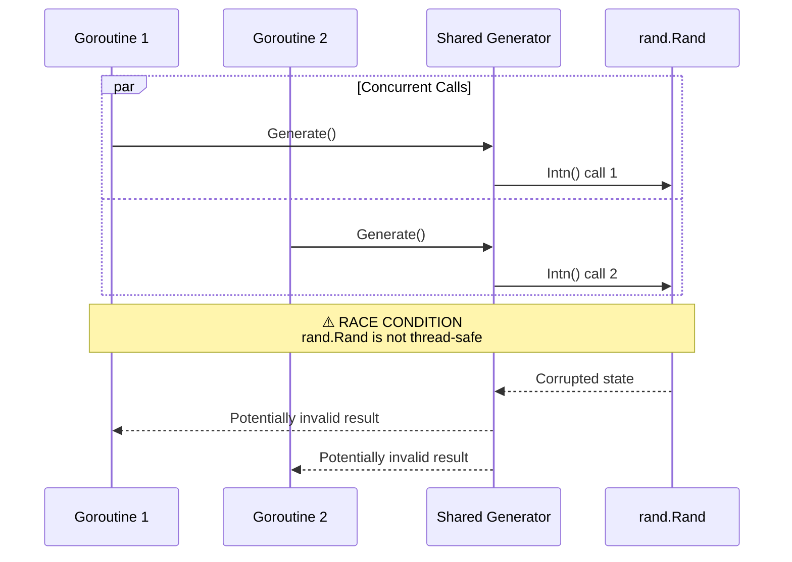
```mermaid
sequenceDiagram
    participant G1 as Goroutine 1
    participant G2 as Goroutine 2
    participant Gen as Shared Generator
    participant PRNG as rand.Rand

    par Concurrent Calls
        G1->>Gen: Generate()
        Gen->>PRNG: Intn() call 1
        and
        G2->>Gen: Generate()
        Gen->>PRNG: Intn() call 2
    end

    Note over G1,PRNG: ⚠️ RACE CONDITION<br/>rand.Rand is not thread-safe

    PRNG-->>Gen: Corrupted state
    Gen-->>G1: Potentially invalid result
    Gen-->>G2: Potentially invalid result
```

### Safe Concurrent Usage Pattern

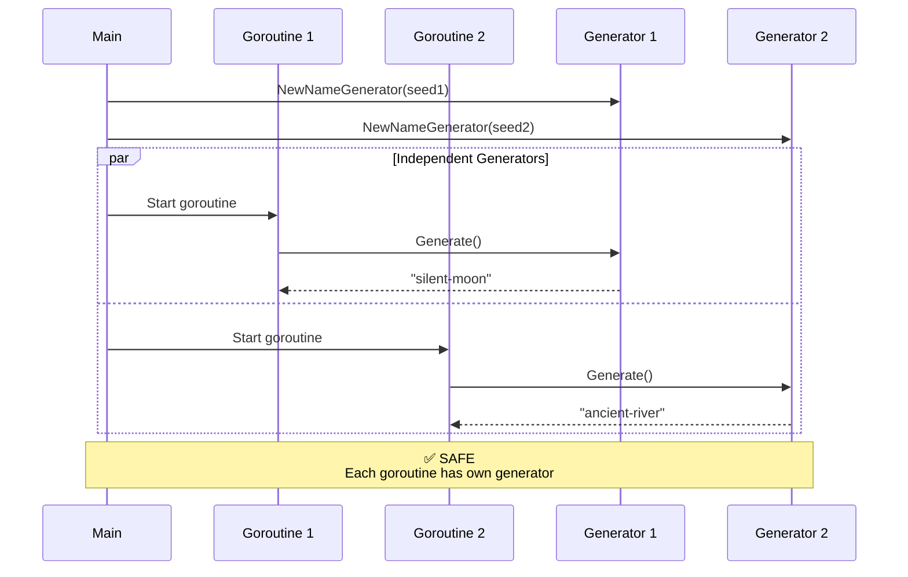
```mermaid
sequenceDiagram
    participant M as Main
    participant G1 as Goroutine 1
    participant G2 as Goroutine 2
    participant Gen1 as Generator 1
    participant Gen2 as Generator 2

    M->>Gen1: NewNameGenerator(seed1)
    M->>Gen2: NewNameGenerator(seed2)

    par Independent Generators
        M->>G1: Start goroutine
        G1->>Gen1: Generate()
        Gen1-->>G1: "silent-moon"
        and
        M->>G2: Start goroutine
        G2->>Gen2: Generate()
        Gen2-->>G2: "ancient-river"
    end

    Note over M,Gen2: ✅ SAFE<br/>Each goroutine has own generator
```

---

## State Diagrams

### Generator Lifecycle

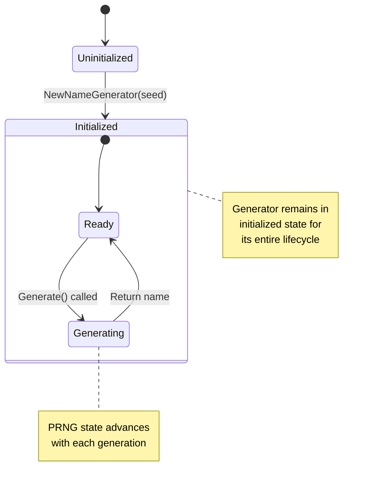
```mermaid
stateDiagram-v2
    [*] --> Uninitialized
    Uninitialized --> Initialized : NewNameGenerator(seed)

    state Initialized {
        [*] --> Ready
        Ready --> Generating : Generate() called
        Generating --> Ready : Return name
    }

    note right of Initialized
        Generator remains in
        initialized state for
        its entire lifecycle
    end note

    note right of Generating
        PRNG state advances
        with each generation
    end note
```

### PRNG State Evolution

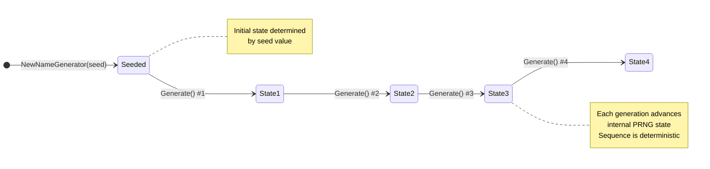
```mermaid
stateDiagram-v2
    direction LR

    [*] --> Seeded : NewNameGenerator(seed)

    Seeded --> State1 : Generate() #1
    State1 --> State2 : Generate() #2
    State2 --> State3 : Generate() #3
    State3 --> State4 : Generate() #4

    note right of Seeded
        Initial state determined
        by seed value
    end note

    note right of State3
        Each generation advances
        internal PRNG state
        Sequence is deterministic
    end note
```

---

## Algorithm Flowcharts

### Generate Method Algorithm

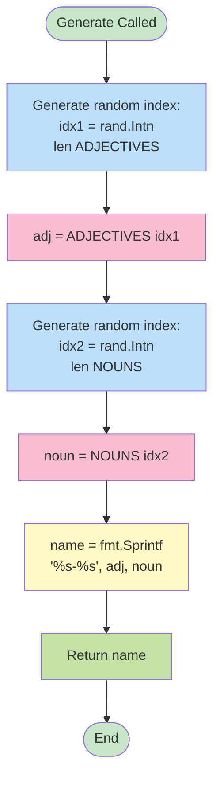
```mermaid
flowchart TD
    Start([Generate Called]) --> GenIdx1[Generate random index:<br/>idx1 = rand.Intn<br/>len ADJECTIVES]
    GenIdx1 --> GetAdj[adj = ADJECTIVES idx1]
    GetAdj --> GenIdx2[Generate random index:<br/>idx2 = rand.Intn<br/>len NOUNS]
    GenIdx2 --> GetNoun[noun = NOUNS idx2]
    GetNoun --> Format[name = fmt.Sprintf<br/>'%s-%s', adj, noun]
    Format --> Return[Return name]
    Return --> End([End])

    style Start fill:#c8e6c9
    style GenIdx1 fill:#bbdefb
    style GetAdj fill:#f8bbd0
    style GenIdx2 fill:#bbdefb
    style GetNoun fill:#f8bbd0
    style Format fill:#fff9c4
    style Return fill:#c5e1a5
    style End fill:#c8e6c9
```

### Name Space Coverage

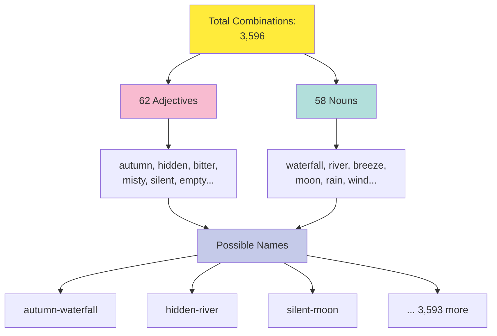
```mermaid
graph TD
    Total[Total Combinations:<br/>3,596] --> Adj[62 Adjectives]
    Total --> Nouns[58 Nouns]

    Adj --> Examples1["autumn, hidden, bitter,<br/>misty, silent, empty..."]
    Nouns --> Examples2["waterfall, river, breeze,<br/>moon, rain, wind..."]

    Examples1 --> Names[Possible Names]
    Examples2 --> Names

    Names --> N1["autumn-waterfall"]
    Names --> N2["hidden-river"]
    Names --> N3["silent-moon"]
    Names --> Etc["... 3,593 more"]

    style Total fill:#ffeb3b
    style Adj fill:#f8bbd0
    style Nouns fill:#b2dfdb
    style Names fill:#c5cae9
```

---

## Performance Characteristics

### Time Complexity Diagram

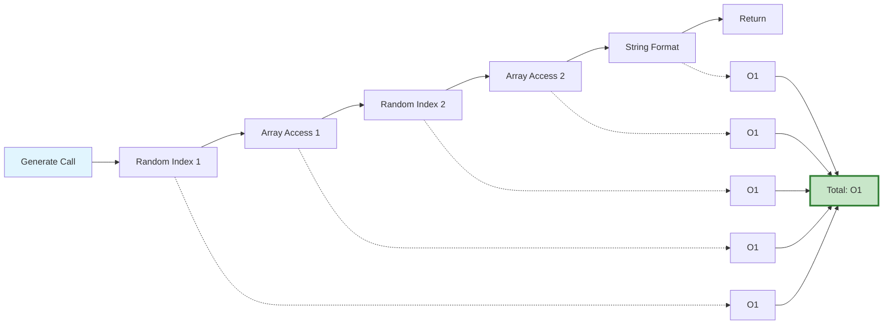
```mermaid
graph LR
    Gen[Generate Call] --> A[Random Index 1]
    A --> B[Array Access 1]
    B --> C[Random Index 2]
    C --> D[Array Access 2]
    D --> E[String Format]
    E --> F[Return]

    A -.-> T1["O1"]
    B -.-> T2["O1"]
    C -.-> T3["O1"]
    D -.-> T4["O1"]
    E -.-> T5["O1"]

    T1 & T2 & T3 & T4 & T5 --> Total["Total: O1"]

    style Gen fill:#e1f5fe
    style Total fill:#c8e6c9,stroke:#2e7d32,stroke-width:3px
```

### Memory Layout

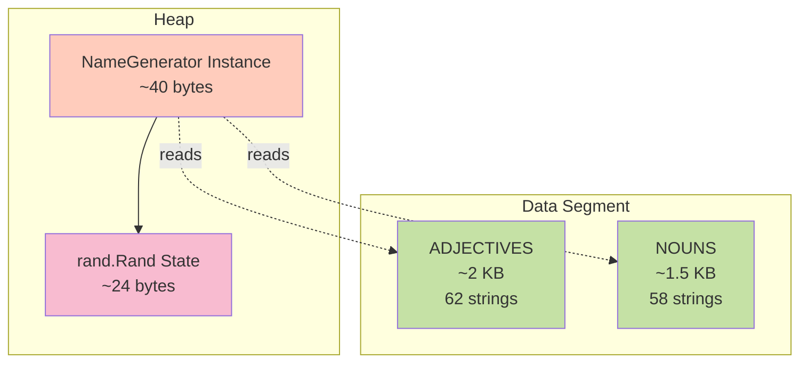
```mermaid
graph TB
    subgraph "Heap"
        NG[NameGenerator Instance<br/>~40 bytes]
        Rand[rand.Rand State<br/>~24 bytes]
    end

    subgraph "Data Segment"
        Adj["ADJECTIVES<br/>~2 KB<br/>62 strings"]
        Nouns["NOUNS<br/>~1.5 KB<br/>58 strings"]
    end

    NG --> Rand
    NG -.->|reads| Adj
    NG -.->|reads| Nouns

    style NG fill:#ffccbc
    style Rand fill:#f8bbd0
    style Adj fill:#c5e1a5
    style Nouns fill:#c5e1a5
```

---

## Integration Patterns

### Library Integration

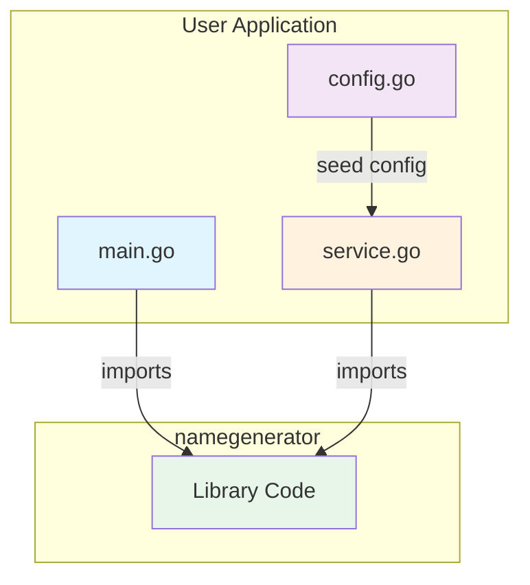
```mermaid
graph TB
    subgraph "User Application"
        Main[main.go]
        Config[config.go]
        Service[service.go]
    end

    subgraph "namegenerator"
        Lib[Library Code]
    end

    Main -->|imports| Lib
    Service -->|imports| Lib
    Config -->|seed config| Service

    style Main fill:#e1f5fe
    style Service fill:#fff3e0
    style Config fill:#f3e5f5
    style Lib fill:#e8f5e9
```

### Common Integration Scenarios

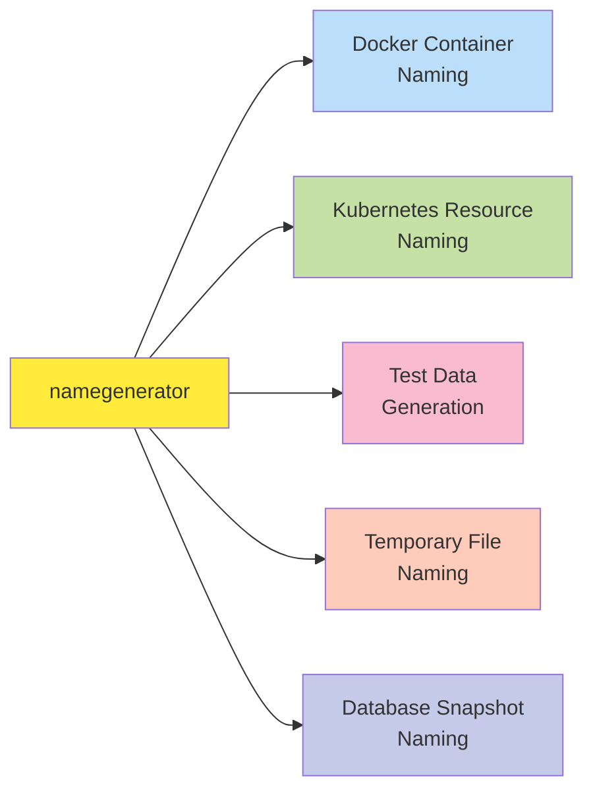
```mermaid
graph LR
    NG[namegenerator]

    NG --> Docker[Docker Container<br/>Naming]
    NG --> K8s[Kubernetes Resource<br/>Naming]
    NG --> Test[Test Data<br/>Generation]
    NG --> Temp[Temporary File<br/>Naming]
    NG --> DB[Database Snapshot<br/>Naming]

    style NG fill:#ffeb3b
    style Docker fill:#bbdefb
    style K8s fill:#c5e1a5
    style Test fill:#f8bbd0
    style Temp fill:#ffccbc
    style DB fill:#c5cae9
```

---

## Related Documentation

- [API Reference](API.md) - Complete API documentation
- [Architecture Details](ARCHITECTURE.md) - Design decisions and implementation
- [Usage Patterns](USAGE_PATTERNS.md) - Real-world integration examples
- [Project Index](INDEX.md) - Documentation navigation

---

**Last Updated**: 2026-01-16
**Diagram Format**: Mermaid.js
**Version**: 1.0.0
